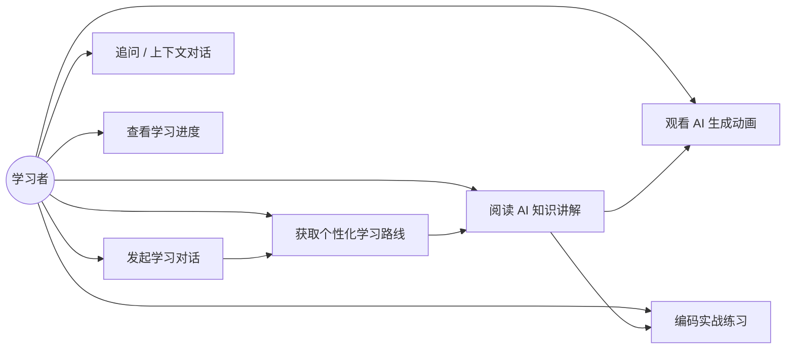
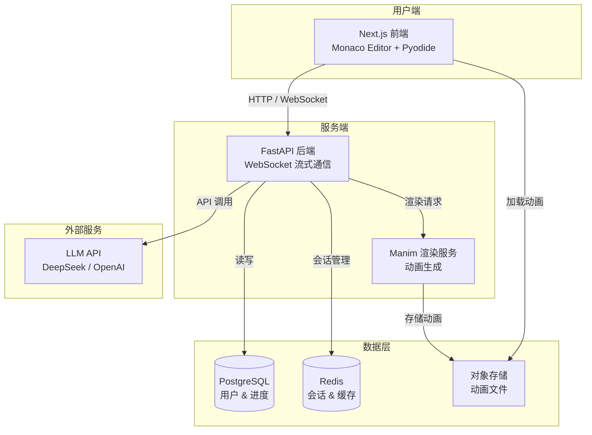
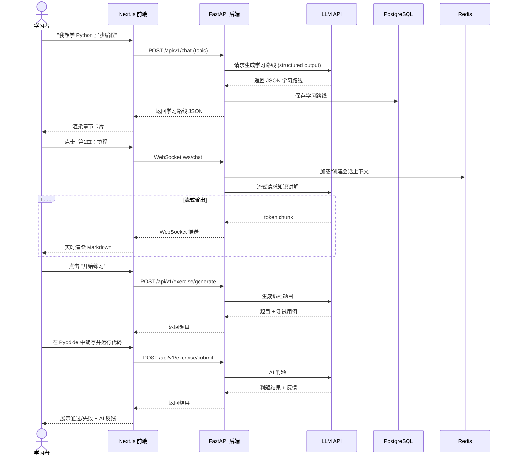
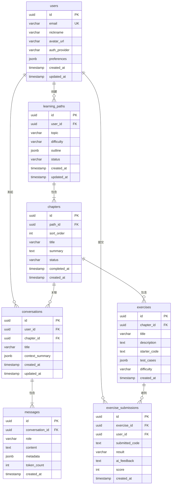
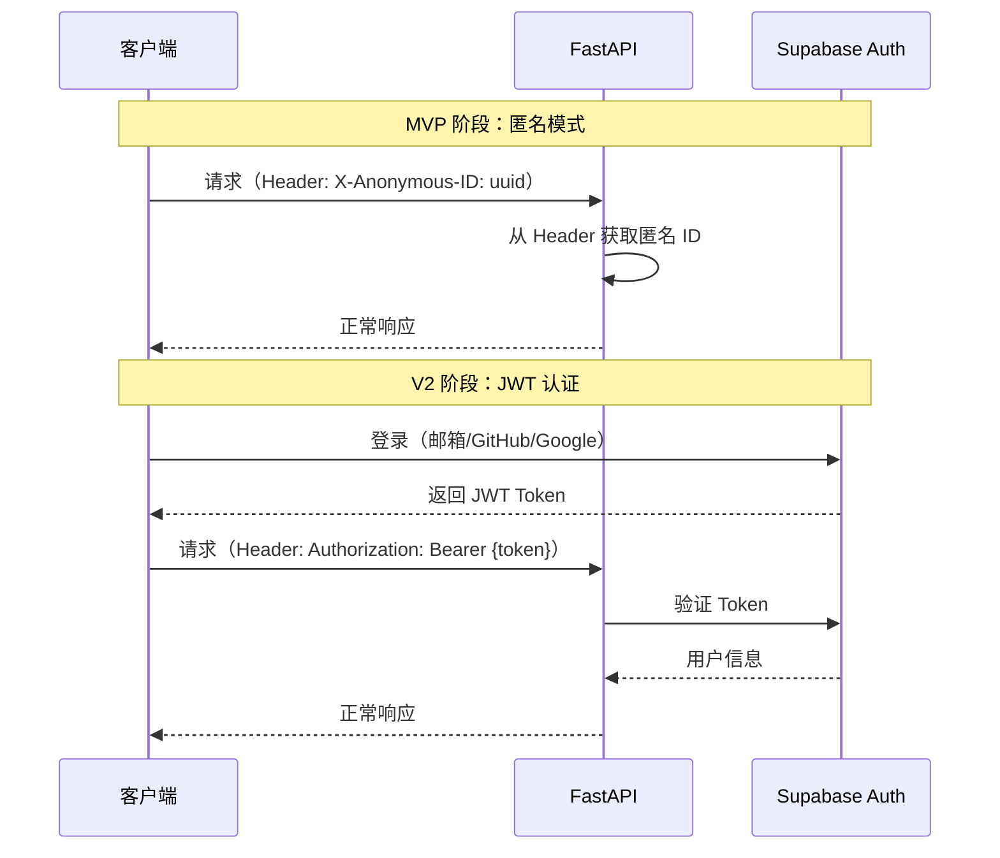
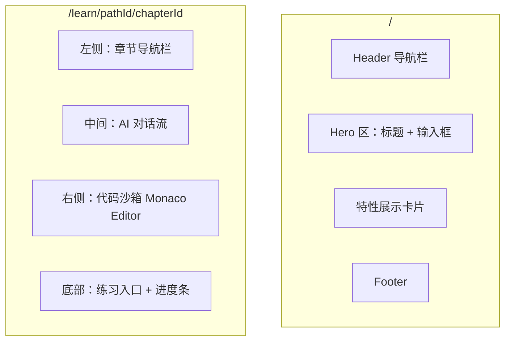
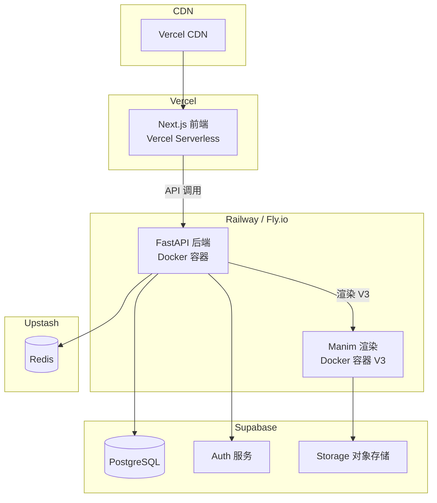
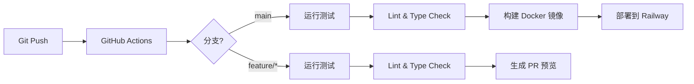

# AI 编程学习平台 — 架构设计文档

> 本文档由 `architect-spec` 技能自动生成，作为开发团队的技术蓝图。

---

## 目录

- [阶段一：需求分析与高层架构](#阶段一需求分析与高层架构)
  - [1.1 核心需求摘要](#11-核心需求摘要)
  - [1.2 用户角色](#12-用户角色)
  - [1.3 关键用例](#13-关键用例)
  - [1.4 系统上下文图](#14-系统上下文图)
  - [1.5 核心模块清单](#15-核心模块清单)
  - [1.6 技术选型](#16-技术选型)
  - [1.7 交互流程时序图](#17-交互流程时序图)
- [阶段二：数据模型设计](#阶段二数据模型设计)
  - [2.1 ER 图](#21-er-图)
  - [2.2 核心数据表说明](#22-核心数据表说明)
  - [2.3 Redis 缓存策略](#23-redis-缓存策略)
- [阶段三：API 接口设计](#阶段三api-接口设计)
  - [3.1 API 路由总览](#31-api-路由总览)
  - [3.2 核心接口详细设计](#32-核心接口详细设计)
  - [3.3 统一错误响应格式](#33-统一错误响应格式)
  - [3.4 认证方案](#34-认证方案)
- [阶段四：前端页面结构设计](#阶段四前端页面结构设计)
  - [4.1 页面路由](#41-页面路由)
  - [4.2 核心页面布局](#42-核心页面布局)
  - [4.3 前端组件架构](#43-前端组件架构)
  - [4.4 状态管理](#44-状态管理)
- [阶段五：部署与 DevOps](#阶段五部署与-devops)
  - [5.1 部署架构](#51-部署架构)
  - [5.2 环境变量清单](#52-环境变量清单)
  - [5.3 Docker 配置](#53-docker-配置)
  - [5.4 CI/CD 流水线](#54-cicd-流水线)
  - [5.5 MVP 阶段项目目录结构](#55-mvp-阶段项目目录结构)

---

## 阶段一：需求分析与高层架构

### 1.1 核心需求摘要

构建一个 **问答式 AI 编程学习平台**，其核心价值在于：

| 维度 | 描述 |
|:---|:---|
| **AI 驱动** | 由 LLM 实时生成学习路线、知识讲解、动画演示和编程练习 |
| **个性化** | 根据用户水平和目标定制学习路径 |
| **交互性** | 流式对话 + 浏览器内代码运行 + AI 实时动画 |
| **差异化** | 结合 AI 对话、结构化路线、代码沙箱和动画生成，区别于 Codecademy、Brilliant、ChatGPT |

### 1.2 用户角色

| 角色 | 说明 | 权限范围 |
|:---|:---|:---|
| **学习者（Learner）** | 使用平台学习编程的主要用户 | 对话、学习路线、代码沙箱、练习 |
| **管理员（Admin）** | 平台维护人员 | 课程管理、用户管理、系统配置、数据统计 |

> **设计决策**：MVP 阶段仅支持学习者角色，管理后台在 V3 阶段引入。

### 1.3 关键用例



### 1.4 系统上下文图



### 1.5 核心模块清单

| 模块 | 职责 | 阶段 |
|:---|:---|:---|
| **对话引擎** | 管理用户与 AI 的多轮对话，维护上下文 | MVP |
| **学习路线生成器** | 调用 LLM 生成结构化学习路线（JSON 输出） | MVP |
| **知识讲解模块** | WebSocket 流式输出 Markdown + 代码高亮内容 | MVP |
| **代码沙箱** | 基于 Pyodide 的浏览器端 Python 运行时 | MVP |
| **AI 判题模块** | AI 出题、用户提交代码、AI 评判 + 反馈 | MVP |
| **步骤式动画** | 前端 CSS/Framer Motion 渲染分步动画 | V2 |
| **用户认证** | Supabase Auth 提供登录/注册能力 | V2 |
| **进度追踪** | 记录用户学习章节完成情况 | V2 |
| **Manim 动画引擎** | LLM 生成 Manim 代码 → 后端渲染 GIF/MP4 | V3 |
| **代码执行可视化** | 变量追踪、逐行执行视图（类似 Python Tutor） | V3 |
| **数据统计面板** | 学习数据分析与可视化 | V3 |

### 1.6 技术选型

| 层次 | 技术 | 选型理由 |
|:---|:---|:---|
| **前端框架** | Next.js 15 (App Router) | SSR/SSG 支持、文件路由、React 生态成熟 |
| **代码编辑器** | Monaco Editor | VS Code 同款引擎，语法高亮 + 智能提示 |
| **浏览器 Python** | Pyodide | 零后端依赖、在浏览器运行标准 CPython |
| **动画（前端）** | Framer Motion | React 原生动画库，声明式 API，流畅 |
| **后端框架** | FastAPI | 原生异步、自动 OpenAPI 文档、性能优秀 |
| **流式通信** | WebSocket | 实时双向通信，适合 AI 流式输出 |
| **LLM 服务** | DeepSeek / OpenAI API | 开发阶段用 DeepSeek（成本低），生产可切 OpenAI |
| **动画渲染** | Manim (Python) | 社区成熟的数学/编程动画库 |
| **关系数据库** | PostgreSQL | 成熟稳定，JSON 支持好，Supabase 原生集成 |
| **缓存 / 会话** | Redis | 高性能 KV 存储，适合会话和 LLM 响应缓存 |
| **认证** | Supabase Auth | 开箱即用、与 PostgreSQL 集成好、免运维 |
| **对象存储** | Supabase Storage / S3 | 存储动画文件，CDN 分发 |

> **备选方案说明**：
> - 后端曾考虑 Django，但 AI 流式场景对异步的高要求使 FastAPI 更合适。
> - 前端曾考虑 Vite + React SPA，但 Next.js 的 SSR 能力对 SEO 和首屏性能更优。

### 1.7 交互流程时序图



---

> **✅ 阶段一完成**

---

## 阶段二：数据模型设计

### 2.1 ER 图



### 2.2 核心数据表说明

#### `users` — 用户表

| 字段 | 类型 | 说明 |
|:---|:---|:---|
| `id` | UUID PK | 主键，与 Supabase Auth UID 一致 |
| `email` | VARCHAR UK | 登录邮箱 |
| `nickname` | VARCHAR | 显示昵称 |
| `avatar_url` | VARCHAR | 头像地址 |
| `auth_provider` | VARCHAR | 认证方式：`email` / `github` / `google` |
| `preferences` | JSONB | 用户偏好：`{ "language": "zh", "theme": "dark" }` |
| `created_at` | TIMESTAMP | 注册时间 |
| `updated_at` | TIMESTAMP | 最后更新 |

> **设计决策**：MVP 阶段不引入 Supabase Auth，`users` 表先做预留，前端使用匿名会话（localStorage 存 UUID）。V2 阶段接入 Supabase Auth 后，`id` 直接映射 Auth UID。

---

#### `learning_paths` — 学习路线表

| 字段 | 类型 | 说明 |
|:---|:---|:---|
| `id` | UUID PK | 主键 |
| `user_id` | UUID FK → users | 创建者 |
| `topic` | VARCHAR | 学习主题，如 `"Python 异步编程"` |
| `difficulty` | VARCHAR | 难度：`beginner` / `intermediate` / `advanced` |
| `outline` | JSONB | LLM 生成的完整路线 JSON |
| `status` | VARCHAR | `active` / `completed` / `archived` |
| `created_at` | TIMESTAMP | 创建时间 |
| `updated_at` | TIMESTAMP | 最后更新 |

> **`outline` JSONB 示例**：
> ```json
> {
>   "total_chapters": 5,
>   "estimated_hours": 8,
>   "prerequisites": ["Python 基础语法"],
>   "chapters": [
>     { "order": 1, "title": "同步 vs 异步", "summary": "..." },
>     { "order": 2, "title": "协程与 await", "summary": "..." }
>   ]
> }
> ```

---

#### `chapters` — 章节表

| 字段 | 类型 | 说明 |
|:---|:---|:---|
| `id` | UUID PK | 主键 |
| `path_id` | UUID FK → learning_paths | 所属学习路线 |
| `sort_order` | INT | 排序序号 |
| `title` | VARCHAR | 章节标题 |
| `summary` | TEXT | 章节概述 |
| `status` | VARCHAR | `locked` / `unlocked` / `in_progress` / `completed` |
| `completed_at` | TIMESTAMP | 完成时间（可 NULL） |
| `created_at` | TIMESTAMP | 创建时间 |

---

#### `conversations` — 对话表

| 字段 | 类型 | 说明 |
|:---|:---|:---|
| `id` | UUID PK | 主键 |
| `user_id` | UUID FK → users | 发起者 |
| `chapter_id` | UUID FK → chapters | 关联章节（可 NULL，独立对话） |
| `title` | VARCHAR | 对话标题（自动生成） |
| `context_summary` | JSONB | 压缩后的上下文摘要（用于长对话） |
| `created_at` | TIMESTAMP | 创建时间 |
| `updated_at` | TIMESTAMP | 最后活跃 |

> **设计决策**：当消息数超过 LLM 上下文窗口时，后端将历史消息压缩为 `context_summary`，仅发送摘要 + 最近 N 条消息给 LLM，保证对话质量。

---

#### `messages` — 消息表

| 字段 | 类型 | 说明 |
|:---|:---|:---|
| `id` | UUID PK | 主键 |
| `conversation_id` | UUID FK → conversations | 所属对话 |
| `role` | VARCHAR | `user` / `assistant` / `system` |
| `content` | TEXT | 消息内容（Markdown） |
| `metadata` | JSONB | 扩展信息：`{ "has_code": true, "has_animation": true }` |
| `token_count` | INT | Token 用量统计 |
| `created_at` | TIMESTAMP | 发送时间 |

---

#### `exercises` — 练习题表

| 字段 | 类型 | 说明 |
|:---|:---|:---|
| `id` | UUID PK | 主键 |
| `chapter_id` | UUID FK → chapters | 所属章节 |
| `title` | VARCHAR | 题目标题 |
| `description` | TEXT | 题目描述（Markdown） |
| `starter_code` | TEXT | 初始代码模板 |
| `test_cases` | JSONB | 测试用例：`[{ "input": "...", "expected": "..." }]` |
| `difficulty` | VARCHAR | `easy` / `medium` / `hard` |
| `created_at` | TIMESTAMP | 创建时间 |

---

#### `exercise_submissions` — 提交记录表

| 字段 | 类型 | 说明 |
|:---|:---|:---|
| `id` | UUID PK | 主键 |
| `exercise_id` | UUID FK → exercises | 关联题目 |
| `user_id` | UUID FK → users | 提交者 |
| `submitted_code` | TEXT | 用户提交的代码 |
| `result` | VARCHAR | `pass` / `fail` / `error` |
| `ai_feedback` | TEXT | AI 判题反馈（Markdown） |
| `score` | INT | 得分（0-100） |
| `created_at` | TIMESTAMP | 提交时间 |

---

### 2.3 Redis 缓存策略

| Key 模式 | 数据 | TTL | 说明 |
|:---|:---|:---|:---|
| `session:{user_id}:{conv_id}` | 对话上下文 JSON | 2h | 活跃对话的完整上下文，避免频繁读库 |
| `path:{path_id}:outline` | 学习路线 JSON | 24h | 路线结构不常变，长缓存 |
| `user:{user_id}:progress` | 进度快照 | 1h | 用户当前学习进度摘要 |
| `llm:cache:{prompt_hash}` | LLM 响应 | 12h | 相同 Prompt 的 LLM 缓存，降本提速 |
| `rate:{user_id}` | 请求计数 | 1min | 限流：每分钟最多 20 次 LLM 调用 |

> **缓存失效策略**：
> - 对话上下文：每次新消息写入时更新缓存，超时后自动过期并在下次请求时从 DB 重建
> - 学习路线：用户修改路线时主动删除缓存（Cache-Aside 模式）
> - LLM 缓存：仅缓存通用知识讲解，个性化内容不缓存

---

> **✅ 阶段二完成**

---

## 阶段三：API 接口设计

### 3.1 API 路由总览

所有 REST API 统一前缀 `/api/v1`，WebSocket 端点前缀 `/ws`。

```
/api/v1
├── /auth              # 认证（V2）
│   ├── POST /register
│   ├── POST /login
│   └── POST /logout
├── /users             # 用户
│   ├── GET  /me
│   └── PATCH /me
├── /paths             # 学习路线
│   ├── POST /generate
│   ├── GET  /{path_id}
│   └── GET  /{path_id}/chapters
├── /chapters          # 章节
│   ├── GET  /{chapter_id}
│   └── PATCH /{chapter_id}/status
├── /conversations     # 对话
│   ├── POST /
│   ├── GET  /{conv_id}
│   └── GET  /{conv_id}/messages
├── /exercises         # 练习
│   ├── POST /generate
│   ├── GET  /{exercise_id}
│   └── POST /{exercise_id}/submit

/ws
└── /chat/{conv_id}    # 流式对话 WebSocket
```

### 3.2 核心接口详细设计

#### 🔹 `POST /api/v1/paths/generate` — 生成学习路线

**请求**：
```json
{
  "topic": "Python 异步编程",
  "difficulty": "intermediate",
  "user_background": "有 Python 基础，了解装饰器"
}
```

**响应** `201 Created`：
```json
{
  "id": "uuid",
  "topic": "Python 异步编程",
  "difficulty": "intermediate",
  "outline": {
    "total_chapters": 5,
    "estimated_hours": 8,
    "chapters": [
      { "order": 1, "title": "同步 vs 异步概念", "summary": "..." },
      { "order": 2, "title": "协程与 await 语法", "summary": "..." },
      { "order": 3, "title": "asyncio 事件循环", "summary": "..." },
      { "order": 4, "title": "异步 IO 实战", "summary": "..." },
      { "order": 5, "title": "并发模式与最佳实践", "summary": "..." }
    ]
  },
  "created_at": "2026-03-21T12:00:00Z"
}
```

**实现流程**：
```
请求 → 参数校验 → 构建 Prompt → 调用 LLM (structured output)
     → 解析 JSON → 写入 learning_paths + chapters 表 → 返回
```

---

#### 🔹 `WebSocket /ws/chat/{conv_id}` — 流式对话

**连接**：`ws://host/ws/chat/{conv_id}?token={jwt_token}`

**客户端发送**：
```json
{
  "type": "message",
  "content": "协程和线程有什么区别？"
}
```

**服务端流式推送**：
```json
// 逐个 token 推送
{ "type": "token", "content": "协" }
{ "type": "token", "content": "程" }
{ "type": "token", "content": "是" }
...
// 结束标记
{ "type": "done", "message_id": "uuid", "token_count": 256 }
```

**服务端错误推送**：
```json
{ "type": "error", "code": "CONTEXT_TOO_LONG", "message": "对话过长，已自动压缩" }
```

**实现流程**：
```
WebSocket 连接 → 鉴权 → 从 Redis 加载上下文
→ 拼接 System Prompt + 历史摘要 + 最近消息 + 用户输入
→ 调用 LLM 流式 API → 逐 token 推送
→ 完整响应写入 messages 表 → 更新 Redis 上下文
```

---

#### 🔹 `POST /api/v1/exercises/generate` — 生成练习题

**请求**：
```json
{
  "chapter_id": "uuid",
  "difficulty": "medium"
}
```

**响应** `201 Created`：
```json
{
  "id": "uuid",
  "title": "实现异步文件读取",
  "description": "使用 `aiofiles` 库异步读取文件内容并返回行数...",
  "starter_code": "import aiofiles\nimport asyncio\n\nasync def count_lines(filepath: str) -> int:\n    # 你的代码\n    pass",
  "test_cases": [
    { "input": "test.txt", "expected": "5", "hidden": false },
    { "input": "empty.txt", "expected": "0", "hidden": true }
  ],
  "difficulty": "medium"
}
```

---

#### 🔹 `POST /api/v1/exercises/{exercise_id}/submit` — 提交代码

**请求**：
```json
{
  "code": "import aiofiles\nimport asyncio\n\nasync def count_lines(filepath):\n    async with aiofiles.open(filepath) as f:\n        lines = await f.readlines()\n        return len(lines)"
}
```

**响应** `200 OK`：
```json
{
  "result": "pass",
  "score": 90,
  "test_results": [
    { "case": 1, "passed": true },
    { "case": 2, "passed": true }
  ],
  "ai_feedback": "✅ 代码正确！建议：可以使用生成器减少内存占用...",
  "submission_id": "uuid"
}
```

### 3.3 统一错误响应格式

```json
{
  "error": {
    "code": "VALIDATION_ERROR",
    "message": "topic 字段不能为空",
    "details": [
      { "field": "topic", "issue": "required" }
    ]
  }
}
```

| HTTP 状态码 | 错误场景 |
|:---|:---|
| `400` | 请求参数校验失败 |
| `401` | 未认证 / Token 过期 |
| `403` | 无权限访问该资源 |
| `404` | 资源不存在 |
| `429` | 请求频率超限（LLM 限流） |
| `500` | 服务端内部错误 |
| `503` | LLM 服务不可用 |

### 3.4 认证方案



> **设计决策**：
> - MVP 阶段使用 `X-Anonymous-ID` Header 标识用户，无需登录即可使用
> - V2 引入 Supabase Auth，中间件自动兼容两种模式
> - 所有需要身份的 API 通过 FastAPI `Depends()` 注入用户信息

---

> **✅ 阶段三完成**

---

## 阶段四：前端页面结构设计

### 4.1 页面路由

| 路由 | 页面 | 说明 | 阶段 |
|:---|:---|:---|:---|
| `/` | 首页 | 欢迎页 + 输入学习话题 | MVP |
| `/learn/[pathId]` | 学习路线页 | 展示章节卡片列表 | MVP |
| `/learn/[pathId]/[chapterId]` | 学习页 | 对话 + 讲解 + 代码沙箱 | MVP |
| `/exercise/[exerciseId]` | 练习页 | 题目 + 编辑器 + 提交 | MVP |
| `/history` | 历史记录 | 学习路线列表 | V2 |
| `/auth/login` | 登录页 | Supabase Auth UI | V2 |
| `/dashboard` | 数据面板 | 学习统计可视化 | V3 |

### 4.2 核心页面布局



> **学习页**采用三栏布局（响应式设计）：
> - **桌面端**：左侧章节导航 (240px) | 中间对话区 (flex) | 右侧代码沙箱 (400px)
> - **移动端**：底部 Tab 切换「对话 / 代码 / 章节」

### 4.3 前端组件架构

```
src/
├── app/                          # Next.js App Router
│   ├── layout.tsx                # 全局布局
│   ├── page.tsx                  # 首页
│   ├── learn/
│   │   ├── [pathId]/
│   │   │   ├── page.tsx          # 学习路线页
│   │   │   └── [chapterId]/
│   │   │       └── page.tsx      # 学习页
│   └── exercise/
│       └── [exerciseId]/
│           └── page.tsx          # 练习页
├── components/
│   ├── chat/
│   │   ├── ChatPanel.tsx         # 对话面板
│   │   ├── MessageBubble.tsx     # 消息气泡
│   │   ├── StreamingText.tsx     # 流式文本渲染
│   │   └── ChatInput.tsx         # 输入框
│   ├── editor/
│   │   ├── CodeEditor.tsx        # Monaco Editor 封装
│   │   ├── OutputPanel.tsx       # 运行结果面板
│   │   └── PyodideRunner.tsx     # Pyodide 执行引擎
│   ├── learning/
│   │   ├── ChapterNav.tsx        # 章节导航栏
│   │   ├── ChapterCard.tsx       # 章节卡片
│   │   └── ProgressBar.tsx       # 进度条
│   └── ui/                       # 通用 UI 组件
│       ├── Button.tsx
│       ├── Card.tsx
│       ├── Loading.tsx
│       └── MarkdownRenderer.tsx  # Markdown + 代码高亮渲染
├── hooks/
│   ├── useWebSocket.ts           # WebSocket 连接管理
│   ├── usePyodide.ts             # Pyodide 运行时 Hook
│   └── useChat.ts                # 对话状态管理
├── lib/
│   ├── api.ts                    # REST API 客户端
│   ├── ws.ts                     # WebSocket 客户端
│   └── pyodide.ts                # Pyodide 初始化
└── stores/
    ├── chatStore.ts              # 对话状态（Zustand）
    └── learningStore.ts          # 学习进度状态
```

### 4.4 状态管理

| 状态域 | 工具 | 数据 |
|:---|:---|:---|
| **对话状态** | Zustand | 消息列表、流式输出缓冲、连接状态 |
| **学习进度** | Zustand | 当前路线、章节状态、完成情况 |
| **代码编辑** | React State | 编辑器内容、运行结果（组件局部） |
| **Pyodide 运行时** | Context | 加载状态、Worker 实例 |
| **服务端数据** | SWR / React Query | API 数据获取与缓存 |

> **设计决策**：使用 **Zustand** 替代 Redux，因为本项目状态逻辑较简单，Zustand 更轻量且不需要 boilerplate。服务端数据通过 **SWR** 管理缓存和重新请求。

---

> **✅ 阶段四完成**

---

## 阶段五：部署与 DevOps

### 5.1 部署架构



### 5.2 环境变量清单

| 变量 | 所属服务 | 说明 |
|:---|:---|:---|
| `DATABASE_URL` | Backend | PostgreSQL 连接串 |
| `REDIS_URL` | Backend | Redis 连接串 |
| `LLM_API_KEY` | Backend | DeepSeek / OpenAI API Key |
| `LLM_MODEL` | Backend | 模型名称，如 `deepseek-chat` |
| `LLM_BASE_URL` | Backend | API Base URL（方便切换） |
| `SUPABASE_URL` | Both | Supabase 项目 URL |
| `SUPABASE_ANON_KEY` | Frontend | Supabase 匿名公钥 |
| `SUPABASE_SERVICE_KEY` | Backend | Supabase 服务端密钥 |
| `NEXT_PUBLIC_API_URL` | Frontend | 后端 API 地址 |
| `NEXT_PUBLIC_WS_URL` | Frontend | WebSocket 地址 |

### 5.3 Docker 配置

```dockerfile
# backend/Dockerfile
FROM python:3.12-slim

WORKDIR /app
COPY requirements.txt .
RUN pip install --no-cache-dir -r requirements.txt

COPY . .
EXPOSE 8000

CMD ["uvicorn", "app.main:app", "--host", "0.0.0.0", "--port", "8000"]
```

```yaml
# docker-compose.yml (本地开发)
version: "3.9"
services:
  backend:
    build: ./backend
    ports:
      - "8000:8000"
    env_file: .env
    depends_on:
      - postgres
      - redis

  postgres:
    image: postgres:16
    environment:
      POSTGRES_DB: codepilot
      POSTGRES_USER: codepilot
      POSTGRES_PASSWORD: dev_password
    ports:
      - "5432:5432"
    volumes:
      - pgdata:/var/lib/postgresql/data

  redis:
    image: redis:7-alpine
    ports:
      - "6379:6379"

volumes:
  pgdata:
```

### 5.4 CI/CD 流水线



| 阶段 | 工具 | 触发 |
|:---|:---|:---|
| **Lint** | Ruff (Python) + ESLint (TS) | 每次 Push |
| **类型检查** | mypy (Python) + TypeScript | 每次 Push |
| **单元测试** | pytest + Vitest | 每次 Push |
| **集成测试** | pytest + httpx | PR → main |
| **部署前端** | Vercel (自动) | Push to main |
| **部署后端** | Railway (Docker) | Push to main |

### 5.5 MVP 阶段项目目录结构

```
CodePilot/
├── frontend/                  # Next.js 前端
│   ├── src/
│   │   ├── app/
│   │   ├── components/
│   │   ├── hooks/
│   │   ├── lib/
│   │   └── stores/
│   ├── public/
│   ├── package.json
│   └── next.config.js
├── backend/                   # FastAPI 后端
│   ├── app/
│   │   ├── main.py            # 入口
│   │   ├── api/               # 路由层
│   │   │   ├── v1/
│   │   │   │   ├── paths.py
│   │   │   │   ├── conversations.py
│   │   │   │   └── exercises.py
│   │   │   └── ws/
│   │   │       └── chat.py    # WebSocket 端点
│   │   ├── core/              # 核心配置
│   │   │   ├── config.py
│   │   │   └── deps.py
│   │   ├── models/            # SQLAlchemy 模型
│   │   ├── schemas/           # Pydantic 模型
│   │   ├── services/          # 业务逻辑
│   │   │   ├── llm.py         # LLM 调用封装
│   │   │   ├── chat.py        # 对话管理
│   │   │   └── exercise.py    # 练习判题
│   │   └── db/
│   │       ├── database.py    # 数据库连接
│   │       └── migrations/    # Alembic 迁移
│   ├── tests/
│   ├── requirements.txt
│   └── Dockerfile
├── docs/
│   └── ARCHITECTURE.md        # 本文档
├── docker-compose.yml
├── .env.example
└── README.md
```

---

> **✅ 全部五个阶段完成** — AI 编程学习平台架构设计文档编写完毕。可以开始 MVP 阶段的开发工作。
